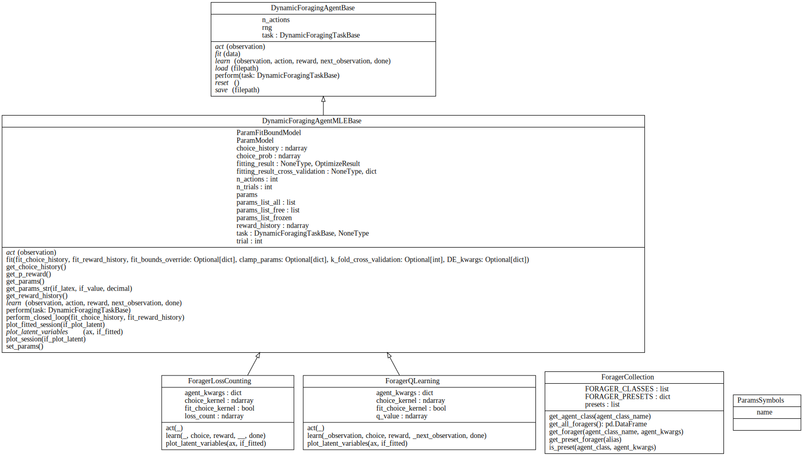

# aind-dynamic-foraging-models

[](LICENSE)

[](https://github.com/semantic-release/semantic-release)


AIND library for generative (RL) and descriptive (logistic regression) models of dynamic foraging tasks.

User documentation available on [readthedocs](https://aind-dynamic-foraging-models.readthedocs.io/).

## Reinforcement Learning (RL) models with Maximum Likelihood Estimation (MLE) fitting

### Overview
RL agents that can perform any dynamic foraging task in [aind-behavior-gym](https://github.com/AllenNeuralDynamics/aind-behavior-gym) and can fit behavior using MLE.


### Code structure

- To add more generative models, please subclass [`DynamicForagingAgentMLEBase`](https://github.com/AllenNeuralDynamics/aind-dynamic-foraging-models/blob/11c858f93f67a0699ed23892364f3f51b08eab37/src/aind_dynamic_foraging_models/generative_model/base.py#L25C7-L25C34).

### Implemented foragers
- [`ForagerQLearning`](https://github.com/AllenNeuralDynamics/aind-dynamic-foraging-models/blob/f9ab39bbdc2cbea350e5a8f11d3f935d6674e08b/src/aind_dynamic_foraging_models/generative_model/forager_q_learning.py): Simple Q-learning agents that incrementally update Q-values.
    - Available `agent_kwargs`:
      ```python
        number_of_learning_rate: Literal[1, 2] = 2,
        number_of_forget_rate: Literal[0, 1] = 1,
        choice_kernel: Literal["none", "one_step", "full"] = "none",
        action_selection: Literal["softmax", "epsilon-greedy"] = "softmax",
      ```
- [`ForagerLossCounting`](https://github.com/AllenNeuralDynamics/aind-dynamic-foraging-models/blob/f9ab39bbdc2cbea350e5a8f11d3f935d6674e08b/src/aind_dynamic_foraging_models/generative_model/forager_loss_counting.py): Loss counting agents with probabilistic `loss_count_threshold`.
    - Available `agent_kwargs`:
      ```python
        win_stay_lose_switch: Literal[False, True] = False,
        choice_kernel: Literal["none", "one_step", "full"] = "none",
      ```
[Here is the full list](https://foraging-behavior-browser.allenneuraldynamics-test.org/RL_model_playground#all-available-foragers) of available foragers:


### Usage
- [Jupyter notebook](https://github.com/AllenNeuralDynamics/aind-dynamic-foraging-models/blob/main/notebook/demo_RL_agents.ipynb)
- See also [these unittest functions](https://github.com/AllenNeuralDynamics/aind-dynamic-foraging-models/tree/main/tests).

### RL model playground

Play with the generative models [here](https://foraging-behavior-browser.allenneuraldynamics-test.org/RL_model_playground).


## Logistic regression
See [this demo notebook.](https://github.com/AllenNeuralDynamics/aind-dynamic-foraging-models/blob/main/notebook/demo_logistic_regression.ipynb)

### Choosing logistic regression models

#### Su 2022


$$
logit(p(c_r)) \sim RewardedChoice+UnrewardedChoice
$$

#### Bari 2019


$$
logit(p(c_r)) \sim RewardedChoice+Choice
$$

#### Hattori 2019


$$
logit(p(c_r)) \sim RewardedChoice+UnrewardedChoice+Choice
$$

#### Miller 2021


$$
logit(p(c_r)) \sim Choice + Reward+ Choice*Reward
$$

#### Encodings

- Ignored trials are removed

| choice | reward | Choice | Reward | RewardedChoice | UnrewardedChoice | Choice * Reward |
| --- | --- | --- | --- | --- | --- | --- |
| L | yes | -1 | 1 | -1 | 0 | -1 |
| L | no | -1 | -1 | 0 | -1 | 1 |
| R | yes | 1 | 1 | 1 | 0 | 1 |
| L | yes | -1 | 1 | -1 | 0 | -1 |
| R | no | 1 | -1 | 0 | 1 | -1 |
| R | yes | 1 | 1 | 1 | 0 | 1 |
| L | no | -1 | -1 | 0 | -1 | 1 |

Some observations:

1. $RewardedChoice$ and $UnrewardedChoice$ are orthogonal
2. $Choice = RewardedChoice + UnrewardedChoice$
3. $Choice  * Reward = RewardedChoice -  UnrewardedChoice$

#### Comparison

|  | Su 2022 | Bari 2019 | Hattori 2019 | Miller 2021 |
| --- | --- | --- | --- | --- |
| Equivalent to | RewC + UnrC | RewC + (RewC + UnrC) | RewC + UnrC + (RewC + UnrC) | (RewC + UnrC) + (RewC - UnrC) + Rew |
| Severity of multicollinearity | Not at all | Medium | Severe | Slight |
| Interpretation | Like a RL model with different learning rates on reward and unrewarded trials. | Like a RL model that only updates on rewarded trials, plus a choice kernel (tendency to repeat previous choices). | Like a RL model that has different learning rates on reward and unrewarded trials, plus a choice kernel (the full RL model from the same paper). | Like a RL model that has symmetric learning rates for rewarded and unrewarded trials, plus a choice kernel. However, the $Reward $ term seems to be a strawman assumption, as it means “if I get reward on any side, I’ll choose the right side more”, which doesn’t make much sense. |
| Conclusion | Probably the best | Okay | Not good due to the severe multicollinearity | Good |


### Regularization and optimization
The choice of optimizer depends on the penality term, as listed [here](https://scikit-learn.org/stable/modules/generated/sklearn.linear_model.LogisticRegression.html#sklearn.linear_model.LogisticRegression).

- `lbfgs` - [`l2`, None]
- `liblinear` - [`l1`, `l2`]
- `newton-cg` - [`l2`, None]
- `newton-cholesky` - [`l2`, None]
- `sag` - [`l2`, None]
- `saga` - [`elasticnet`, `l1`, `l2`, None]

## See also
- Foraging model simulation, model recovery, etc.: https://github.com/hanhou/Dynamic-Foraging

## Installation
To install the software, run
```bash
pip install aind-dynamic-foraging-models
```

To develop the code, clone the repo to your local machine, and run
```bash
pip install -e .[dev]
```

## Contributing

### Linters and testing

There are several libraries used to run linters, check documentation, and run tests.

- Please test your changes using the **coverage** library, which will run the tests and log a coverage report:

```bash
coverage run -m unittest discover && coverage report
```

- Use **interrogate** to check that modules, methods, etc. have been documented thoroughly:

```bash
interrogate .
```

- Use **flake8** to check that code is up to standards (no unused imports, etc.):
```bash
flake8 .
```

- Use **black** to automatically format the code into PEP standards:
```bash
black .
```

- Use **isort** to automatically sort import statements:
```bash
isort .
```

### Pull requests

For internal members, please create a branch. For external members, please fork the repository and open a pull request from the fork. We'll primarily use [Angular](https://github.com/angular/angular/blob/main/CONTRIBUTING.md#commit) style for commit messages. Roughly, they should follow the pattern:
```text
<type>(<scope>): <short summary>
```

where scope (optional) describes the packages affected by the code changes and type (mandatory) is one of:

- **build**: Changes that affect build tools or external dependencies (example scopes: pyproject.toml, setup.py)
- **ci**: Changes to our CI configuration files and scripts (examples: .github/workflows/ci.yml)
- **docs**: Documentation only changes
- **feat**: A new feature
- **fix**: A bugfix
- **perf**: A code change that improves performance
- **refactor**: A code change that neither fixes a bug nor adds a feature
- **test**: Adding missing tests or correcting existing tests

### Semantic Release

The table below, from [semantic release](https://github.com/semantic-release/semantic-release), shows which commit message gets you which release type when `semantic-release` runs (using the default configuration):

| Commit message                                                                                                                                                                                   | Release type                                                                                                    |
| ------------------------------------------------------------------------------------------------------------------------------------------------------------------------------------------------ | --------------------------------------------------------------------------------------------------------------- |
| `fix(pencil): stop graphite breaking when too much pressure applied`                                                                                                                             | ~~Patch~~ Fix Release, Default release                                                                          |
| `feat(pencil): add 'graphiteWidth' option`                                                                                                                                                       | ~~Minor~~ Feature Release                                                                                       |
| `perf(pencil): remove graphiteWidth option`<br><br>`BREAKING CHANGE: The graphiteWidth option has been removed.`<br>`The default graphite width of 10mm is always used for performance reasons.` | ~~Major~~ Breaking Release <br /> (Note that the `BREAKING CHANGE: ` token must be in the footer of the commit) |

### Documentation
To generate the rst files source files for documentation, run
```bash
sphinx-apidoc -o doc_template/source/ src 
```
Then to create the documentation HTML files, run
```bash
sphinx-build -b html doc_template/source/ doc_template/build/html
```
More info on sphinx installation can be found [here](https://www.sphinx-doc.org/en/master/usage/installation.html).
